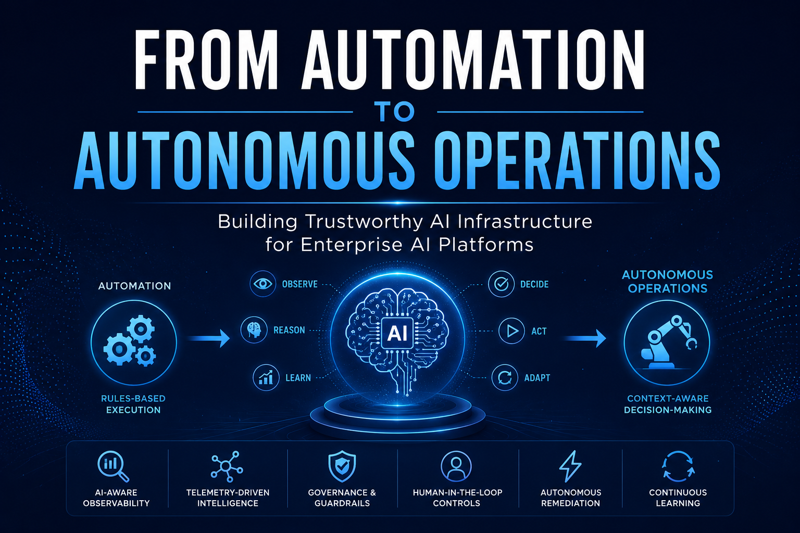

# From Automation to Autonomous Operations

## Building Trustworthy AI Infrastructure for Enterprise AI Platforms



---

> **"Automation executes predefined workflows. Autonomous operations determine the most appropriate action before execution."**

---

**Author:** Gopalasivam Palaniappan

**Status:** Version 1.0 Draft

**Primary Publication:** LinkedIn Article

**GitHub Canonical Version:** This document

**LinkedIn Article:** Pending

**Medium:** Pending

**Published:** June 2026

**Estimated Reading Time:** ~20 minutes

**Audience:** Platform Engineers, AI Infrastructure Engineers, Enterprise Architects, AI Engineers, Technology Leaders

**Category:** AI Infrastructure

**Tags:** AI, Agentic AI, AI Infrastructure, Autonomous Operations, AIOps, Platform Engineering, AI Governance, AI-Aware Observability, Cloud-Native AI

## Version History

| Version | Date | Description |
|----------|------------|-----------------------------------------|
| 1.0 Draft | 2026-06-30 | Initial flagship article |

---

## Executive Summary

Enterprise infrastructure operations are entering a new phase.

For many years, automation has helped organizations improve consistency, reduce manual effort, and accelerate operational response. Automation remains essential, but the rise of AI agents, autonomous workflows, and AI-enabled platforms is changing the operational model.

The next stage is not simply more automation.

It is autonomous operations.

> **Automation improves execution. Autonomous operations improve decision-making.**

Autonomous operations introduce systems that can observe signals, evaluate context, reason through possible actions, validate decisions against policy, execute approved remediation, and continuously learn from outcomes.

This shift creates new architectural requirements for modern AI platforms. Organizations need infrastructure that is not only scalable and performant, but also observable, governed, secure, explainable, and accountable.

This article explores the transition from traditional automation to autonomous operations and outlines the foundational capabilities required to build trustworthy AI infrastructure for enterprise AI platforms.

Key capabilities include:

* AI-aware observability
* Telemetry-driven intelligence
* Governance and guardrails
* Human-in-the-loop controls
* Autonomous remediation
* Continuous learning

Together, these capabilities form the foundation for trusted autonomous operations.

---

# Enterprise Architecture Overview

The following reference architecture summarizes the major concepts discussed throughout this article. Each subsequent section expands on one or more components of this architecture.


---

## Introduction

Artificial Intelligence is changing more than the applications organizations build.

It is also changing how infrastructure is operated.

Modern AI platforms are becoming increasingly dynamic. AI agents can interact with APIs, orchestrate workflows, analyze telemetry, and participate in operational decision-making. As these systems become more capable, infrastructure teams must rethink how they observe, govern, secure, and remediate AI-driven environments.

Traditional operations were designed around relatively predictable systems.

Applications emitted logs. Infrastructure generated metrics. Alerts triggered tickets. Automation executed predefined workflows.

This model still has value, but it is no longer sufficient for environments where AI systems can reason, adapt, and act across complex infrastructure and application ecosystems.

The central challenge is no longer only:

> How do we automate repetitive tasks?

The emerging challenge is:

> How do we build infrastructure that can support autonomous systems safely, transparently, and responsibly?

That question introduces a broader architectural responsibility.

Enterprise AI infrastructure must provide more than compute capacity, model serving, and application deployment. It must provide the operational foundation for trust.

Trustworthy AI infrastructure enables organizations to:

* Observe autonomous behavior
* Understand AI-driven decisions
* Govern AI agents
* Enforce operational policies
* Maintain human oversight where appropriate
* Remediate intelligently
* Learn continuously from operational outcomes

This article presents an architectural view of how enterprise operations are evolving from automation toward autonomous operations, and why trustworthy AI infrastructure is becoming a critical foundation for modern AI platforms.

To understand why trustworthy AI infrastructure matters, it helps to first look at how enterprise operations have evolved from manual administration to automation, and now toward autonomous decision-making.

---

# The Evolution of Enterprise Operations

Enterprise operations have continuously evolved alongside advances in computing infrastructure.

Early operational models were primarily manual. Infrastructure administrators relied on human observation, documented procedures, and operational experience to identify issues and restore services.

As enterprise environments grew in scale and complexity, manual operations became increasingly difficult to sustain.

Automation emerged as the next significant evolution.

Operational teams began automating repetitive tasks such as service restarts, infrastructure provisioning, configuration management, backup operations, and incident response. Automation improved consistency, reduced operational effort, and minimized human error by executing predefined workflows based on predefined conditions.

A typical operational flow resembled:

```text
Alert
    ↓
Rule
    ↓
Automation
    ↓
Action
```

This model continues to provide significant value across enterprise environments.

However, modern AI platforms introduce operational characteristics that differ fundamentally from traditional enterprise applications.

AI systems generate substantially larger volumes of telemetry, operate across distributed infrastructure, consume specialized compute resources such as GPUs, interact with external services, and increasingly include autonomous agents capable of making operational decisions.

These environments are far more dynamic than conventional application platforms.

Operational events rarely occur in isolation.

A single issue may involve multiple applications, AI models, GPUs, Kubernetes clusters, storage systems, networking components, security controls, and business services simultaneously.

As complexity increases, predefined automation alone becomes increasingly difficult to maintain.

Rather than asking:

> "Which predefined workflow should execute?"

organizations increasingly need systems capable of asking:

> "Given the current operational context, what is the most appropriate action?"

Answering that question requires capabilities that extend beyond traditional automation.

Modern AI platforms require systems capable of:

* Collecting and correlating telemetry from multiple sources.
* Understanding operational context.
* Reasoning across multiple remediation options.
* Validating actions against organizational policies.
* Determining when human approval is appropriate.
* Continuously learning from operational outcomes.

This transition represents a shift from automation toward autonomous operations.

Autonomous operations do not replace automation.

Instead, they build upon it by introducing context-aware reasoning, policy-driven decision making, and continuous operational learning.

The remainder of this article explores the architectural capabilities required to support this new operational model and explains why trustworthy AI infrastructure is becoming an essential foundation for enterprise AI platforms.

This evolution raises an important architectural question: if automation helped organizations execute predefined workflows, what additional capabilities are required when systems begin evaluating context and making operational decisions?

---

# Beyond Automation: Why Autonomous Operations Matter

Automation has transformed enterprise operations over the past two decades.

From infrastructure provisioning and configuration management to deployment pipelines and incident response, automation has enabled organizations to improve consistency, reduce operational effort, and increase service reliability.

Modern cloud-native platforms have accelerated this trend by enabling infrastructure to be managed declaratively through Infrastructure as Code, GitOps, policy engines, and automated operational workflows.

These capabilities remain fundamental to modern platform engineering.

However, traditional automation operates within a predefined decision model.

The workflow, execution logic, and expected response are typically known before an operational event occurs.

Examples include:

* Restart a failed service.
* Scale a deployment when CPU utilization exceeds a threshold.
* Create a ticket when a monitoring alert is triggered.
* Execute a predefined disaster recovery workflow.

These automations are deterministic.

Given the same inputs, they consistently produce the same outputs.

This predictability makes automation highly effective for repetitive and well-understood operational tasks.

Autonomous operations introduce a fundamentally different operational paradigm.

Rather than simply executing predefined workflows, autonomous systems evaluate operational context, reason across multiple potential actions, and determine the most appropriate response based on current conditions.

A simplified comparison illustrates this evolution.

### Traditional Automation

```text
Event
    ↓
Predefined Rule
    ↓
Execute Workflow
    ↓
Complete
```

### Autonomous Operations

```text
Operational Signals
        ↓
Context Correlation
        ↓
Reasoning
        ↓
Policy Validation
        ↓
Decision
        ↓
Action
        ↓
Continuous Learning
```

The difference is not simply the addition of artificial intelligence.

The difference lies in the decision-making model.

Automation executes instructions that have already been defined.

Autonomous operations continuously evaluate changing operational conditions before determining how to respond.

This capability becomes increasingly valuable within enterprise AI environments where infrastructure conditions change rapidly and operational events often span multiple systems simultaneously.

An autonomous operational platform may consider:

* Infrastructure health
* AI model availability
* GPU resource utilization
* Application dependencies
* Security posture
* Compliance requirements
* Organizational policies
* Business priorities

Rather than evaluating a single metric, autonomous systems synthesize multiple sources of operational intelligence before selecting an appropriate course of action.

Importantly, autonomous operations should not be viewed as a replacement for automation.

Automation remains an essential execution mechanism.

Autonomous operations extend automation by introducing intelligent decision-making, contextual awareness, policy-driven governance, and continuous operational learning.

Viewed together, the relationship can be summarized as:

```text
Automation
        +
Operational Intelligence
        +
Governance
        +
Human Oversight
        =
Autonomous Operations
```

This architectural evolution establishes the foundation for the remaining capabilities discussed throughout this article, including AI-aware observability, telemetry-driven intelligence, governance, autonomous remediation, and trustworthy AI infrastructure.

The first requirement for autonomous operations is visibility. Before an autonomous system can reason, govern, or remediate, it must be able to observe not only infrastructure health, but also AI behavior, decisions, and operational context.

---

# AI-Aware Observability

Observability has become one of the foundational capabilities of modern cloud-native platforms.

Over the past decade, organizations have invested heavily in collecting logs, metrics, traces, events, and application telemetry to improve operational visibility.

These capabilities have significantly enhanced the ability to monitor infrastructure, diagnose incidents, and improve application reliability.

Traditional observability answers questions such as:

* Is the application healthy?
* Which service is experiencing increased latency?
* Which infrastructure component is failing?
* What changed before the incident occurred?

These questions remain essential.

However, autonomous AI systems introduce an entirely new operational dimension.

Modern AI platforms are no longer composed solely of applications and infrastructure.

They increasingly include AI agents capable of reasoning, interacting with external systems, orchestrating workflows, and making operational decisions.

As these systems become more autonomous, operations teams require visibility beyond infrastructure health.

They increasingly need visibility into **AI behavior**.

This introduces a new category of operational questions:

* Why did the AI agent choose this action?
* Which telemetry influenced its decision?
* Which tools or APIs were invoked?
* Was the selected action consistent with organizational policy?
* Could an alternative remediation have produced a better outcome?
* Was human approval required before execution?

These questions cannot be answered through traditional infrastructure telemetry alone.

They require observability that captures not only **what happened**, but also **why it happened**.

This is where AI-aware observability becomes essential.

AI-aware observability extends traditional observability by incorporating operational context, agent behavior, reasoning pathways, policy decisions, and governance events into the overall observability model.

Rather than monitoring only applications and infrastructure, organizations gain visibility into the operational lifecycle of autonomous systems.

A modern AI-aware observability platform should provide visibility across several dimensions.

### Infrastructure Observability

Understanding the health and performance of compute, networking, storage, Kubernetes clusters, GPU resources, and cloud infrastructure.

### Application Observability

Monitoring AI-enabled applications, APIs, inference services, user interactions, and service dependencies.

### Agent Observability

Tracking AI agent behavior, task execution, tool usage, orchestration workflows, and decision sequences.

### Decision Observability

Capturing the operational context, reasoning pathways, policy validations, and approval workflows that influenced each autonomous decision.

### Governance Observability

Recording policy evaluations, security controls, audit events, compliance checks, and human approvals to support operational accountability.

Collectively, these capabilities enable organizations to construct a comprehensive operational view of autonomous AI systems.

Equally important is **decision traceability**.

As AI systems participate in operational decision-making, organizations must be able to reconstruct the sequence of events that led to a specific outcome.

Decision traceability enables engineers, security teams, auditors, and platform operators to understand:

* Which operational signals were evaluated.
* Which policies influenced the decision.
* Which remediation options were considered.
* Why a particular action was selected.
* Whether governance controls were successfully enforced.

This level of transparency is critical for building trust in autonomous systems.

Observability therefore evolves beyond operational monitoring.

It becomes a mechanism for understanding, validating, and governing autonomous behavior.

Viewed architecturally, AI-aware observability forms the foundation upon which telemetry-driven intelligence, governance, autonomous remediation, and trustworthy AI infrastructure are built.

Without visibility into autonomous decision-making, organizations cannot confidently govern or scale autonomous operations.

For enterprise AI platforms, observability is no longer simply about system health.

It becomes the foundation for operational trust.

> **Observability explains what happened. AI-aware observability helps explain why it happened.**

Observability provides visibility, but visibility alone does not create operational intelligence. Enterprise AI platforms must also transform telemetry into context-aware decisions.

---

# Telemetry-Driven Intelligence

Observability provides visibility into enterprise systems.

However, visibility alone does not enable intelligent operations.

Modern AI platforms generate enormous volumes of operational telemetry from applications, infrastructure, AI models, Kubernetes clusters, GPUs, networks, APIs, security tools, and business services.

Every second, these environments produce logs, metrics, traces, events, alerts, configuration changes, audit records, and infrastructure health signals.

Collecting this telemetry is necessary.

Understanding it is significantly more challenging.

Enterprise operations increasingly face a different problem.

The challenge is no longer the availability of operational data.

The challenge is transforming that data into meaningful operational intelligence.

This distinction becomes especially important as organizations deploy autonomous AI systems.

Autonomous agents cannot rely solely on isolated metrics or individual alerts.

Effective operational decisions require a broader understanding of the environment.

For example, consider a sudden increase in application response time.

Traditional monitoring may identify elevated latency and generate an alert.

An autonomous operational platform, however, must evaluate a much richer operational context before determining an appropriate response.

It may consider:

* Application health
* Infrastructure utilization
* GPU availability
* AI model performance
* Kubernetes scheduling events
* Storage latency
* Network connectivity
* Security posture
* Recent configuration changes
* Organizational policies
* Business priorities

Individually, these signals provide only partial insight.

Together, they establish the operational context required for informed decision-making.

Telemetry-driven intelligence is therefore the process of transforming diverse operational signals into actionable intelligence that supports autonomous operations.

Rather than reacting to individual events, autonomous platforms continuously correlate telemetry across multiple domains to understand what is happening, why it is happening, and what actions should be considered.

A simplified operational intelligence pipeline can be represented as:

```text
Telemetry
      ↓
Correlation
      ↓
Context
      ↓
Reasoning
      ↓
Decision Intelligence
      ↓
Operational Action
```

Each stage adds additional value.

### Telemetry Collection

Operational data is continuously collected from infrastructure, applications, AI workloads, cloud platforms, security controls, and enterprise services.

This includes logs, metrics, traces, events, alerts, topology information, and operational metadata.

### Correlation

Individual telemetry signals are correlated to identify relationships that may not be visible through isolated observations.

Correlation connects events across applications, infrastructure components, AI agents, and business services.

### Context Enrichment

Correlation alone is insufficient.

Operational intelligence requires additional context such as infrastructure dependencies, service ownership, business impact, security posture, deployment history, maintenance windows, and organizational policies.

Context transforms operational data into operational understanding.

### Reasoning

Reasoning evaluates the available evidence to identify possible causes, estimate operational impact, and determine potential remediation strategies.

Rather than selecting the first available action, reasoning compares multiple alternatives before recommending an appropriate response.

### Decision Intelligence

Decision intelligence combines operational context, reasoning outcomes, governance requirements, and organizational objectives to determine the safest and most effective operational decision.

This stage represents the transition from operational awareness to autonomous decision-making.

### Operational Action

Only after completing the previous stages should autonomous systems execute operational actions.

These actions may include:

* Scaling infrastructure
* Restarting services
* Reallocating GPU resources
* Updating configurations
* Triggering security workflows
* Escalating incidents
* Requesting human approval
* Executing autonomous remediation

Importantly, telemetry-driven intelligence is not intended to eliminate human decision-making.

Instead, it provides the operational insight necessary for both autonomous systems and human operators to make better decisions.

As enterprise environments continue growing in complexity, the ability to transform telemetry into operational intelligence becomes increasingly valuable.

Organizations that successfully adopt autonomous operations will likely differentiate themselves not by the amount of telemetry they collect, but by how effectively they convert that telemetry into trusted operational decisions.

Telemetry therefore becomes much more than monitoring data.

It becomes the foundation of intelligent enterprise operations.

Once telemetry becomes operational intelligence, the next architectural requirement is governance. Autonomous systems may be capable of making decisions, but enterprise platforms must ensure those decisions remain aligned with policy, security, compliance, and business intent.

---

# Governance for AI Agents

As AI systems become increasingly capable of making operational decisions, governance becomes one of the most important architectural requirements for enterprise AI platforms.

Traditional enterprise applications generally operate within predefined business logic. Their behavior is largely deterministic, and operational controls are implemented through application design, access controls, and operational procedures.

AI agents introduce a different operational model.

Rather than simply executing predefined instructions, autonomous agents may evaluate context, select tools, invoke APIs, coordinate workflows, interact with external systems, and make decisions that directly affect enterprise infrastructure.

As the decision-making capability of AI systems increases, organizations must ensure those decisions remain aligned with enterprise policies, security requirements, regulatory obligations, and business objectives.

Governance provides the framework that enables organizations to safely adopt autonomous operations without sacrificing operational control.

Importantly, governance should not be viewed as a mechanism that restricts autonomy.

Instead, governance establishes the operational boundaries within which autonomous systems can safely operate.

A practical governance model for enterprise AI platforms can be viewed as six interconnected capabilities.

```text
Identity
      ↓
Policies
      ↓
Guardrails
      ↓
Approvals
      ↓
Auditability
      ↓
Trust
```

Each capability builds upon the previous one.

## Identity

Every autonomous agent should possess a clearly defined operational identity.

Identity establishes:

* Authentication
* Authorization
* Operational ownership
* Service identity
* Credential management
* Role-based access

Treating AI agents as first-class enterprise identities enables organizations to apply the same security principles used for human users and enterprise services.

Identity answers the fundamental question:

**Who is performing this action?**

---

## Policies

Policies define the operational boundaries within which autonomous systems may operate.

Examples include:

* Infrastructure policies
* Security policies
* Compliance policies
* Resource allocation policies
* Change management policies
* Data governance policies

Policies provide the rules that autonomous systems must evaluate before executing operational actions.

---

## Guardrails

Policies define expectations.

Guardrails enforce them.

Guardrails ensure autonomous systems remain within approved operational boundaries by validating proposed actions before execution.

Examples include:

* Blocking destructive operations
* Restricting privileged commands
* Limiting resource consumption
* Preventing unauthorized API access
* Enforcing geographic or regulatory restrictions

Guardrails reduce operational risk while preserving the benefits of autonomy.

---

## Approvals

Not every operational decision should be executed autonomously.

High-impact decisions may require human review before execution.

Examples include:

* Production infrastructure modifications
* Security policy changes
* Compliance-sensitive operations
* Large-scale remediation actions
* Data deletion
* Disaster recovery activities

Approval workflows enable organizations to introduce human oversight where operational risk justifies additional review.

This is not a limitation of autonomous systems.

It is an important mechanism for responsible governance.

---

## Auditability

Every autonomous decision should be traceable.

Organizations must be able to answer questions such as:

* What decision was made?
* Why was it made?
* Which telemetry influenced the decision?
* Which policies were evaluated?
* Which guardrails were applied?
* Was human approval required?
* What action was ultimately executed?

Auditability provides the transparency necessary for operational accountability, compliance, incident investigations, and continuous improvement.

---

## Trust

Trust is not a standalone capability.

It is the outcome of effective governance.

Organizations are more likely to adopt autonomous operations when they can demonstrate that AI systems operate within clearly defined boundaries, comply with organizational policies, maintain complete audit trails, and provide appropriate opportunities for human oversight.

In this sense, trust is earned rather than assumed.

It emerges from the successful integration of identity, policies, guardrails, approvals, and auditability into the operational lifecycle.

Viewed architecturally, governance serves as the control plane for autonomous operations.

It enables organizations to safely increase operational autonomy while maintaining security, accountability, and regulatory compliance.

Without governance, autonomous systems may be technically capable but operationally difficult to trust.

With governance, organizations establish the confidence required to scale autonomous AI across enterprise environments.

> **Governance should enable autonomy, not restrict it.**

Governance establishes the boundaries for autonomous systems, but not every decision should be executed without human review. The next design consideration is where human oversight should remain part of the operational workflow.

---

# Human-in-the-Loop Controls

One of the most common misconceptions surrounding autonomous AI systems is that the ultimate objective is to eliminate human involvement from operational decision-making.

In practice, enterprise operations present a more complex reality.

Modern AI systems are becoming increasingly capable of analyzing telemetry, correlating operational events, reasoning through multiple remediation strategies, and executing infrastructure actions with minimal human intervention.

These capabilities significantly improve operational efficiency.

However, increased autonomy also increases operational responsibility.

Organizations must determine not only **what autonomous systems can do**, but also **what they should be permitted to do independently**.

This distinction is fundamental to responsible AI operations.

Human-in-the-loop (HITL) controls provide a governance mechanism that enables organizations to balance operational autonomy with appropriate oversight.

Rather than limiting autonomous systems, HITL controls establish confidence that high-impact operational decisions receive the level of review appropriate to their associated risk.

Viewed architecturally, human oversight should be considered a dynamic capability rather than a fixed requirement.

Not every operational decision requires human approval.

Routine operational activities may be executed autonomously with minimal risk.

Examples include:

* Restarting failed services
* Scaling workloads within approved limits
* Rotating certificates
* Clearing temporary resources
* Rebalancing infrastructure capacity
* Updating operational dashboards

These actions are repetitive, well understood, and typically governed through predefined operational policies.

Conversely, certain operational decisions may introduce significant business, security, or compliance implications.

Examples include:

* Production infrastructure changes
* Security policy modifications
* Privileged access requests
* Large-scale remediation activities
* Data deletion
* Disaster recovery execution
* Regulatory or compliance-sensitive operations

In these situations, human approval provides an additional layer of governance before execution.

A practical governance model therefore applies different levels of autonomy based on operational risk.

```text
                Low Risk
                   │
                   ▼
        Fully Autonomous

                   │
                   ▼
      Policy Validation Only

                   │
                   ▼
 Human Notification

                   │
                   ▼
 Human Approval Required

                   │
                   ▼
      Manual Execution

               High Risk
```

This graduated approach enables organizations to maximize the benefits of autonomous operations while preserving appropriate operational safeguards.

Importantly, human oversight should occur **at decision points**, not throughout every operational workflow.

Autonomous systems should continue to collect telemetry, perform analysis, correlate operational context, evaluate remediation options, and recommend actions before requesting human approval when required.

This allows human operators to focus on validating strategic decisions rather than performing repetitive operational tasks.

Human oversight therefore becomes a mechanism for governing autonomous decision-making rather than replacing autonomous capabilities.

As enterprise AI platforms mature, organizations may also adjust these approval boundaries.

Operational decisions that initially require human approval may become fully autonomous over time as confidence, operational maturity, and governance mechanisms improve.

This progressive approach allows organizations to increase autonomy responsibly rather than attempting to achieve full autonomy immediately.

Ultimately, trustworthy autonomous systems are not defined by the absence of humans.

They are defined by the intelligent application of human oversight where operational risk justifies additional governance.

Human-in-the-loop controls therefore represent an architectural design principle that enables organizations to scale autonomous operations while preserving accountability, transparency, and trust.

> **Human oversight is not a weakness. It is how autonomous systems earn trust.**

With observability, intelligence, governance, and human oversight in place, enterprise platforms can begin approaching remediation differently. The goal is no longer only to automate actions, but to determine the safest and most appropriate action before execution.

---

# Autonomous Remediation

Incident response has traditionally been one of the most operationally intensive responsibilities within enterprise IT.

For decades, organizations have relied on predefined runbooks, operational playbooks, escalation procedures, and automated workflows to restore services following operational incidents.

These approaches remain highly effective for well-understood operational scenarios.

However, modern AI platforms present significantly more complex operating environments.

A single operational incident may involve multiple AI agents, distributed Kubernetes clusters, GPU infrastructure, model-serving platforms, networking components, storage systems, security controls, and cloud services simultaneously.

In these environments, selecting the correct remediation strategy often requires significantly more than executing a predefined workflow.

The operational challenge is no longer:

> **How do we automate remediation?**

The challenge becomes:

> **How do we determine the most appropriate remediation before taking action?**

This distinction defines autonomous remediation.

Autonomous remediation combines AI-aware observability, telemetry-driven intelligence, governance, and policy validation to determine the safest and most effective operational response.

Rather than reacting to isolated alerts, autonomous systems continuously evaluate the broader operational context before executing remediation.

A practical autonomous remediation lifecycle consists of six stages.

```text
Detect
      ↓
Analyze
      ↓
Reason
      ↓
Validate
      ↓
Remediate
      ↓
Learn
```

Each stage contributes to safer and more intelligent operational decisions.

## Detect

The process begins with continuous monitoring across infrastructure, applications, AI workloads, security platforms, and business services.

Potential operational issues may originate from:

* Infrastructure alerts
* Application telemetry
* AI model performance
* GPU utilization
* Security events
* Configuration drift
* Policy violations
* User-reported incidents

Detection identifies that an operational condition requires further evaluation.

---

## Analyze

Detection alone does not provide sufficient information for decision-making.

The platform must correlate telemetry from multiple domains to understand the broader operational situation.

Analysis may include:

* Dependency mapping
* Service topology
* Historical incidents
* Infrastructure utilization
* Business impact
* Recent configuration changes
* Deployment history

This stage transforms isolated alerts into meaningful operational context.

---

## Reason

Once sufficient context has been established, autonomous systems evaluate multiple remediation options.

Rather than selecting the first available response, reasoning compares potential actions by considering:

* Expected operational impact
* Risk
* Probability of success
* Resource availability
* Policy constraints
* Business priorities

Reasoning enables systems to recommend the most appropriate remediation strategy rather than simply executing predefined automation.

---

## Validate

Every proposed remediation should be validated before execution.

Validation confirms that the selected action aligns with:

* Organizational policies
* Security requirements
* Compliance obligations
* Operational guardrails
* Approval workflows

Where required, validation may also initiate human approval before execution.

Validation provides an important safeguard that reduces operational risk while preserving autonomous capabilities.

---

## Remediate

Only after successful validation should autonomous systems execute operational changes.

Examples include:

* Restarting services
* Scaling infrastructure
* Reallocating GPU resources
* Updating configurations
* Isolating compromised workloads
* Rolling back deployments
* Triggering disaster recovery workflows

Execution should remain observable, auditable, and continuously monitored throughout the remediation process.

---

## Learn

Every remediation provides valuable operational knowledge.

Successful outcomes, unsuccessful actions, approval decisions, policy evaluations, and post-incident analysis all contribute to improving future operational intelligence.

Continuous learning enables organizations to:

* Improve remediation accuracy
* Refine governance policies
* Reduce false positives
* Strengthen operational playbooks
* Increase confidence in autonomous decision-making

This feedback loop is what differentiates autonomous remediation from traditional automation.

The operational lifecycle therefore becomes one of continuous improvement rather than repetitive execution.

---

## Key Outcomes

When autonomous remediation is implemented as part of a trustworthy AI platform, organizations can achieve several important operational outcomes.

* AI-driven decision making
* Adaptive operational responses
* Policy-compliant remediation
* Context-aware execution
* Reduced mean time to resolution (MTTR)
* Improved operational resilience
* Continuous learning and improvement

Importantly, autonomous remediation should not be viewed as replacing operational teams.

Instead, it augments human expertise by allowing AI systems to perform continuous analysis, evaluate operational alternatives, recommend appropriate actions, and execute approved remediation while maintaining governance and accountability.

Viewed architecturally, autonomous remediation represents the operational execution layer of trustworthy AI infrastructure.

It is the point at which observability, operational intelligence, governance, and human oversight converge to deliver safe, intelligent, and continuously improving enterprise operations.

Ultimately, autonomous remediation is not defined by how quickly systems react.

It is defined by how intelligently they determine the right action before execution.

Autonomous remediation brings together the capabilities discussed so far: observability, telemetry intelligence, governance, human oversight, and adaptive execution. The next step is to understand how these capabilities fit into a broader trustworthy AI infrastructure architecture.

---

# Building Trustworthy AI Infrastructure

Enterprise AI platforms are rapidly evolving beyond traditional application hosting environments.

They are becoming intelligent operational ecosystems where AI agents, autonomous workflows, cloud-native applications, data platforms, and infrastructure services continuously interact to support business operations.

As organizations adopt increasingly autonomous systems, infrastructure must evolve beyond providing compute resources alone.

Trustworthy AI infrastructure provides the architectural foundation that enables autonomous systems to operate safely, transparently, and responsibly.

Rather than viewing observability, governance, remediation, and security as isolated capabilities, enterprise AI platforms should integrate these capabilities into a unified operational architecture.

The architecture discussed throughout this article can be viewed holistically through the following conceptual reference framework, which illustrates how observability, telemetry-driven intelligence, governance, human oversight, and autonomous remediation collectively establish trustworthy AI infrastructure.


A conceptual reference architecture may be viewed as five interconnected layers.

```text
                 AI & Business Applications
                          │
                          ▼
                    Trust Layer
                          │
                          ▼
          Autonomous Operations Platform
                          │
                          ▼
             Infrastructure Foundation
                          │
                          ▼
                  Operational Outcomes
```

Each layer contributes a distinct responsibility while collectively enabling trusted autonomous operations.

---

## AI & Business Applications

The upper layer represents the workloads that consume AI infrastructure.

These may include:

* AI Agents
* Generative AI Applications
* Enterprise Business Applications
* Intelligent Assistants
* Automation Platforms
* Decision Support Systems

These workloads increasingly participate in operational decision-making and require infrastructure capable of supporting secure, observable, and governed execution.

---

## Trust Layer

The Trust Layer provides the governance capabilities that ensure autonomous systems operate within clearly defined organizational boundaries.

Core capabilities include:

* Identity & Access Management
* Policy Enforcement
* Governance & Compliance
* Security Guardrails
* Audit & Accountability
* Human Oversight
* Model & Agent Registry

This layer establishes confidence that every autonomous decision is authenticated, authorized, governed, auditable, and explainable.

Rather than limiting autonomy, the Trust Layer enables organizations to safely expand autonomous capabilities while maintaining operational control.

---

## Autonomous Operations Platform

The Autonomous Operations Platform serves as the operational intelligence layer of the architecture.

It continuously observes enterprise environments, correlates operational telemetry, reasons through potential actions, validates proposed decisions, and coordinates remediation workflows.

Key capabilities include:

* AI-Aware Observability
* Telemetry Correlation
* Operational Context
* Decision Intelligence
* Policy Validation
* Autonomous Remediation
* Continuous Learning

Together, these capabilities transform raw operational data into trusted operational decisions.

---

## Infrastructure Foundation

The Infrastructure Foundation provides the resilient platform upon which autonomous operations are built.

Typical platform services include:

* Compute Infrastructure
* GPU Resources
* Network
* Storage
* Kubernetes & OpenShift
* Cloud & Hybrid Infrastructure
* Data Platforms
* APIs & Enterprise Integrations

These foundational services enable enterprise AI workloads to operate at scale while supporting observability, governance, and operational resilience.

---

## Operational Outcomes

When these architectural layers operate together, organizations can realize meaningful operational outcomes.

These include:

* Observable AI Systems
* Governed Decision Making
* Secure Autonomous Operations
* Explainable Operational Decisions
* Policy-Compliant Execution
* Adaptive Infrastructure
* Continuous Operational Improvement

These outcomes represent the practical realization of trustworthy AI infrastructure.

---

## Architectural Principles

Although implementation details will vary between organizations, several architectural principles remain broadly applicable.

### Design for Observability

Autonomous systems should expose sufficient operational telemetry to understand infrastructure health, agent behavior, and decision pathways.

Observability should extend beyond applications to include AI reasoning, policy evaluation, and operational context.

---

### Govern Before You Automate

Autonomy should operate within clearly defined organizational boundaries.

Identity, policies, guardrails, and auditability should be established before expanding autonomous operational capabilities.

---

### Build Context-Aware Intelligence

Operational decisions should consider multiple sources of telemetry rather than isolated events.

Context enables systems to make informed decisions instead of reacting to individual alerts.

---

### Apply Human Oversight Strategically

Human approval should be reserved for operational decisions with significant business, security, or compliance implications.

Routine operational activities should continue to execute autonomously where appropriate.

---

### Continuously Learn

Every operational event should improve future operational decision-making.

Continuous learning enables autonomous systems to become increasingly reliable while maintaining organizational trust.

---

## Trust as an Architectural Property

One of the most important observations throughout this discussion is that trust is not implemented by a single technology.

Trust emerges from the interaction of multiple architectural capabilities working together.

Observability provides visibility.

Telemetry provides operational awareness.

Reasoning enables intelligent decision-making.

Governance establishes operational boundaries.

Human oversight manages risk.

Autonomous remediation delivers adaptive execution.

Continuous learning improves future outcomes.

Together, these capabilities create AI platforms that organizations can confidently operate in production environments.

Trust therefore becomes an architectural property rather than a standalone feature.

It is designed into the platform rather than added afterward.

As enterprise AI continues to evolve, trustworthy AI infrastructure will become an essential foundation for safely scaling autonomous operations across increasingly complex business environments.

---

At its core, trustworthy AI infrastructure is not defined by how autonomous a platform becomes.

It is defined by how observable, governed, secure, explainable, accountable, and continuously improving that autonomy remains.

> **Trust is not implemented by a single technology. It emerges from architecture.**

While the architecture provides a target state, most organizations will not reach this model in a single step. Adoption should be incremental, allowing operational maturity, governance, and trust to grow together.

---

# Enterprise Adoption Considerations

Building trustworthy AI infrastructure is not a single technology initiative.

It represents an organizational transformation that spans platform engineering, infrastructure operations, security, governance, application development, and enterprise architecture.

Organizations do not need to achieve fully autonomous operations immediately.

Instead, successful adoption typically occurs through incremental operational maturity.

A practical adoption journey often progresses through several stages.

```text
Reactive Operations
        ↓
Automated Operations
        ↓
Observable Operations
        ↓
Intelligent Operations
        ↓
Governed Autonomous Operations
```

Each stage builds upon capabilities established in the previous stage.

For many organizations, the most effective approach is to strengthen operational visibility before expanding autonomous decision-making.

Without reliable observability, autonomous systems lack the operational context necessary to make informed decisions.

Similarly, governance should mature alongside autonomy.

Organizations should establish clear policies, operational guardrails, approval workflows, and audit mechanisms before allowing autonomous systems to perform increasingly critical operational tasks.

Operational trust develops gradually.

As autonomous systems consistently demonstrate reliable, policy-compliant behavior, organizations can safely expand the scope of autonomous decision-making.

This measured approach enables enterprises to balance innovation with operational risk while maintaining confidence in production environments.

Ultimately, successful adoption depends not only on advances in artificial intelligence, but also on disciplined engineering practices, governance, and continuous operational learning.

As organizations mature through these stages, the role of AI infrastructure will continue to expand. The future will likely be defined by platforms that combine autonomy, governance, observability, and continuous learning as core operational capabilities.

---

# Looking Ahead

Enterprise AI platforms will continue evolving rapidly over the coming years.

AI agents are expected to become increasingly capable of coordinating complex workflows, interacting across multiple enterprise systems, and participating in operational decision-making with greater autonomy.

As these capabilities mature, enterprise infrastructure must evolve accordingly.

Future AI platforms will likely place greater emphasis on:

* Multi-agent collaboration
* AI-native observability
* Decision intelligence
* Policy-driven operations
* Explainable AI systems
* Autonomous infrastructure management
* Continuous governance
* Adaptive operational learning

Success will not be determined solely by deploying increasingly capable AI models.

It will depend on building platforms that enable those models to operate responsibly within enterprise environments.

Organizations that invest early in observability, governance, operational intelligence, and trustworthy AI infrastructure will be better positioned to safely scale autonomous operations as the technology continues to mature.

Rather than viewing autonomy as a destination, enterprises should consider it an ongoing capability that evolves alongside operational maturity.

These trends point toward a broader shift in enterprise operations. The long-term value of autonomous operations will depend not only on AI capability, but on the trustworthiness of the infrastructure that enables it.

---

Enterprise AI Applications
           │
           ▼
AI-Aware Observability
           │
           ▼
Telemetry-Driven Intelligence
           │
           ▼
Governance
           │
           ▼
Human Oversight
           │
           ▼
Autonomous Remediation
           │
           ▼
Trustworthy AI Infrastructure


# Conclusion

Enterprise operations are entering a new era.

Automation will continue to play an essential role in modern infrastructure, but the increasing adoption of AI agents, intelligent workflows, and autonomous decision-making is reshaping how enterprise platforms are designed and operated.

This evolution requires more than faster automation.

It requires infrastructure capable of observing, understanding, governing, securing, and continuously improving autonomous operational behavior.

Throughout this article, several foundational capabilities have been explored:

* AI-Aware Observability
* Telemetry-Driven Intelligence
* Governance for AI Agents
* Human-in-the-Loop Controls
* Autonomous Remediation
* Trustworthy AI Infrastructure

Individually, each capability addresses a specific aspect of autonomous operations.

Collectively, they establish the architectural foundation required to deploy enterprise AI systems safely, transparently, and responsibly.

As AI continues to become more deeply integrated into enterprise operations, trustworthy AI infrastructure will become increasingly important—not only for enabling autonomous capabilities, but also for building the confidence necessary for organizations to adopt them at scale.

Ultimately, the future of enterprise operations is unlikely to be defined by automation alone.

It will be defined by systems that combine operational intelligence, governance, observability, and continuous learning to deliver autonomous operations that organizations can trust.

---

# Further Reading

## Standards & Frameworks

- NIST AI Risk Management Framework (AI RMF)
- OWASP Top 10 for LLM Applications
- OpenTelemetry Documentation

## Cloud Native

- Kubernetes
- OpenShift AI
- CNCF Platform Engineering

## Responsible AI

- Responsible AI Principles
- AI Governance Frameworks
  
---

## About the Author

**Gopalasivam Palaniappan**

Lead Technical Architect with expertise in AI Infrastructure, Autonomous AI Operations, Platform Engineering, Kubernetes, OpenShift, Observability, and Enterprise AI Platforms.

Through technical publications, architecture frameworks, open-source contributions, and enterprise solution development, he explores practical approaches for designing trustworthy, scalable, and governed AI platforms for modern enterprise environments.

* LinkedIn: https://linkedin.com/in/gopalasivam
* GitHub: https://github.com/gopal1cloud

💡 *Always learning, Always building.*
