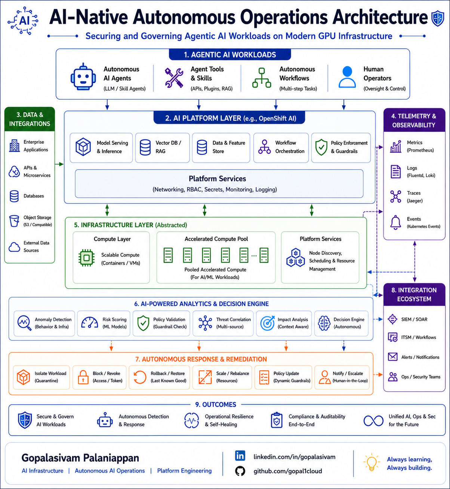

# AI-Native Autonomous Operations Architecture

**Post Number:** 1  
**Status:** Published  
**Published Platform:** LinkedIn  
**LinkedIn Publish Date:** 2026-06-10  
**LinkedIn URL:** https://www.linkedin.com/posts/gopalasivam_ai-agenticai-aiops-activity-7470500933324627968-t9Hx  
**Category:** Autonomous AI Operations  
**Tags:** AI, AgenticAI, AIOps, PlatformEngineering, AutonomousAIOperations, AIArchitecture, InfrastructureEngineering

## Securing and Governing Agentic AI Workloads on Modern GPU Infrastructure

As AI systems become more autonomous, modern infrastructure operations are evolving rapidly.

Traditional monitoring and rule-based operational models were primarily designed around applications, servers, and users.

But Agentic AI changes the model entirely.

AI agents can now:

* interact with APIs and infrastructure
* orchestrate workflows autonomously
* make operational decisions dynamically
* adapt behavior in real time

This creates a much larger need for:

* observability
* governance
* policy enforcement
* autonomous remediation
* operational guardrails

This architecture explores what an AI-native autonomous operations model could look like for modern AI platforms and GPU-enabled infrastructure environments.

---

## Key Concepts Explored

### Autonomous Operations

Operational frameworks designed to enable intelligent, adaptive, and policy-aware infrastructure operations.

### AI-Aware Observability

Telemetry-driven visibility into AI workloads, infrastructure events, operational activities, and runtime behavior.

### Telemetry-Driven Intelligence

Operational insights derived from logs, metrics, traces, events, and platform telemetry.

### Autonomous Anomaly Detection

AI-aware operational monitoring capable of identifying abnormal behavior patterns and infrastructure deviations.

### Policy Validation & Governance

Governance mechanisms for validating workload behavior, operational policies, infrastructure controls, and remediation workflows.

### Autonomous Remediation

Automated operational responses triggered through intelligent analysis and policy-driven orchestration.

### Human-in-the-Loop Controls

Operational approval models that maintain governance and oversight for critical remediation workflows.

---

## Areas of Interest

* AI Infrastructure
* Autonomous AI Operations
* Platform Engineering
* AI Governance
* AI-Aware Observability
* Cloud-Native AI Platforms
* Kubernetes & OpenShift AI
* Autonomous Infrastructure Operations
* Operational Intelligence
* GPU Infrastructure Operations

---

## Operational Focus Areas

Some of the operational areas explored within this architecture include:

* AI-aware observability
* telemetry-driven reasoning
* autonomous anomaly detection
* policy validation and governance
* self-healing operational workflows
* human-in-the-loop remediation controls

One thing becoming increasingly clear:

The future of operations will not just be automated — it will be contextual, intelligent, and autonomous.

---

## Connect

LinkedIn
https://linkedin.com/in/gopalasivam

GitHub
https://github.com/gopal1cloud

---

Gopalasivam Palaniappan

AI Infrastructure | Autonomous AI Operations | Platform Engineering

💡 Always learning, Always building.
