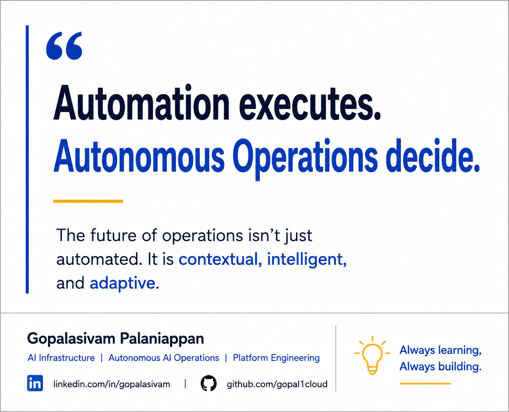

# Automation vs Autonomous Operations

**Status:** Published  
**Published Platform:** LinkedIn  
**LinkedIn Publish Date:** 2026-06-12  
**LinkedIn URL:** https://www.linkedin.com/posts/gopalasivam_ai-agenticai-aiops-activity-7471222416204058624-7KYe
**Category:** Autonomous AI Operations  
**Tags:** AI, AgenticAI, AIOps, PlatformEngineering, AutonomousAIOperations, Automation, OperationalIntelligence

## Automation executes. Autonomous Operations decide.

One thing I've noticed lately is that we often use the terms automation and autonomous operations interchangeably.

But I don't think they're the same thing.

Traditional automation is incredibly effective at executing predefined actions based on predefined conditions.

For example:

* If a service goes down, restart it.
* If CPU utilization exceeds a threshold, scale out.
* If a ticket is created, trigger a workflow.

The logic is known in advance.

Autonomous operations introduce a different model.

Instead of simply executing predefined actions, an autonomous system may:

* analyze multiple sources of telemetry
* evaluate operational context
* reason through multiple remediation options
* select the most appropriate action
* determine when human approval is required

As AI platforms become more dynamic, this distinction becomes increasingly important.

Modern AI systems, autonomous workflows, and AI agents often operate in environments where predefined rules alone may not be enough.

The future is not about replacing automation.

It is about combining automation, observability, governance, and decision intelligence into a more adaptive operational model.

## Discussion

Where do you draw the line between automation and autonomous operations?

At what point does a system stop following rules and start making operational decisions?

---

Gopalasivam Palaniappan

AI Infrastructure | Autonomous AI Operations | Platform Engineering

Always learning, Always building.
