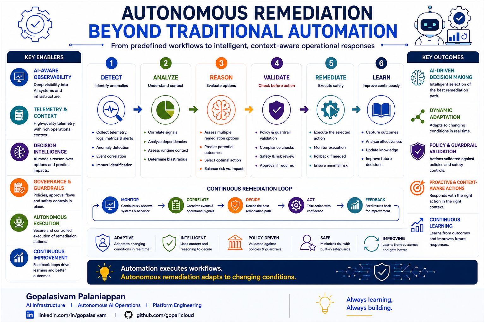

# Autonomous Remediation Beyond Traditional Automation

**Post Number:** 7  
**Status:** Published  
**Published Platform:** LinkedIn  
**LinkedIn Publish Date:** 2026-06-30  
**LinkedIn URL:** https://www.linkedin.com/posts/gopalasivam_ai-agenticai-aiops-share-7477749009546137600-Jay2  
**Category:** Autonomous AI Operations  
**Tags:** AI, AgenticAI, AIOps, AutonomousOperations, PlatformEngineering, AIInfrastructure, Observability, Governance

## Automation executes workflows.

### Autonomous remediation adapts to changing conditions.

As AI systems become more autonomous, remediation is becoming one of the most significant areas of operational transformation.

Traditional automation has helped operations teams execute predefined actions for years.

Examples include:

- Restarting failed services
- Scaling infrastructure based on predefined thresholds
- Triggering operational workflows from alerts
- Executing scheduled maintenance tasks

These workflows are highly effective because the expected response is known before the event occurs.

Modern AI platforms, however, often operate in environments where predefined rules alone may not be sufficient.

A single operational issue may involve:

- Multiple telemetry sources
- Dynamic infrastructure conditions
- Security policies
- Compliance requirements
- Business priorities
- Several possible remediation paths

The challenge is no longer simply executing an action.

The challenge is selecting the most appropriate action.

---

## Key Enablers

Autonomous remediation relies on several foundational capabilities working together.

### AI-Aware Observability

Provides deep operational visibility into AI systems, infrastructure, workloads, and agent behavior.

### Telemetry & Context

Correlates logs, metrics, traces, topology, events, and operational context to understand what is happening.

### Decision Intelligence

Reasons across multiple remediation options to determine the safest and most effective response.

### Governance & Guardrails

Validates proposed actions against organizational policies, approval workflows, compliance requirements, and operational controls.

### Autonomous Execution

Executes approved remediation actions while continuously monitoring operational outcomes.

### Continuous Improvement

Uses every remediation outcome to improve future operational decision-making.

---

## Autonomous Remediation Workflow

A practical autonomous remediation workflow consists of six stages.

### 1. Detect

Identify anomalies using telemetry, logs, metrics, traces, events, and alerts.

### 2. Analyze

Correlate operational signals and understand the broader system context.

### 3. Reason

Evaluate multiple remediation options, predict potential outcomes, and determine the optimal response.

### 4. Validate

Verify proposed actions against policies, governance controls, security requirements, and approval rules.

### 5. Remediate

Execute the selected action while minimizing operational risk and continuously monitor execution.

### 6. Learn

Capture operational outcomes, update organizational knowledge, and improve future remediation decisions.

---

## Continuous Remediation Loop

Autonomous remediation is not a one-time workflow.

Every remediation generates additional operational intelligence that continuously improves future decision-making.

A continuous improvement cycle typically follows:

**Monitor → Correlate → Decide → Act → Feedback**

Each cycle increases the quality, confidence, and effectiveness of future autonomous responses.

---

## Key Outcomes

When autonomous remediation is built on strong observability, operational intelligence, and governance, organizations can realize several important outcomes.

### AI-Driven Decision Making

Select the most appropriate remediation based on operational context and predicted outcomes.

### Dynamic Adaptation

Continuously adjust remediation actions as infrastructure conditions evolve.

### Policy & Guardrail Validation

Ensure every remediation aligns with organizational policies, governance requirements, and compliance controls.

### Proactive & Context-Aware Actions

Respond intelligently using operational context rather than static rule-based workflows.

### Continuous Learning & Improvement

Capture operational outcomes, strengthen future decision-making, and continuously improve autonomous remediation capabilities.

---

## Key Characteristics

- Adaptive
- Intelligent
- Policy-Driven
- Safe
- Continuously Improving

---

## Discussion

Autonomous remediation is not about replacing automation.

It is about combining observability, telemetry, operational context, reasoning, governance, and continuous learning to enable systems to respond intelligently to changing operational conditions.

Because ultimately:

> **Automation executes workflows. Autonomous remediation adapts to changing conditions.**

As AI platforms continue to evolve, where do you believe organizations should draw the line between fully autonomous remediation and human approval?

---

**Gopalasivam Palaniappan**

AI Infrastructure | Autonomous AI Operations | Platform Engineering

💡 Always learning, Always building.
