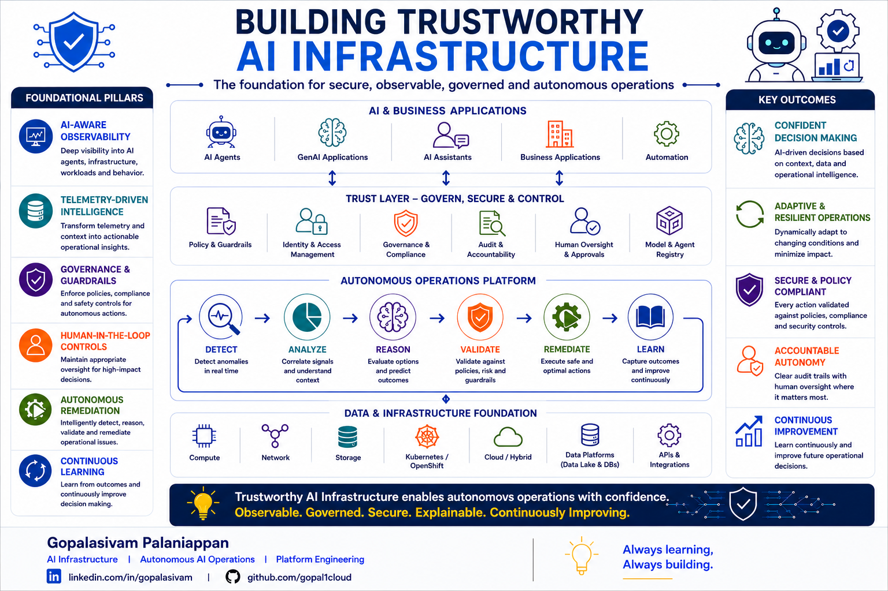

# Building Trustworthy AI Infrastructure

**Post Number:** 8  
**Status:** Scheduled  
**Published Platform:** LinkedIn  
**LinkedIn Publish Date:** 2026-07-02  
**LinkedIn URL:** Pending  
**Category:** AI Infrastructure  
**Tags:** AI, AgenticAI, AIOps, AIInfrastructure, AutonomousOperations, PlatformEngineering, ResponsibleAI, Observability, Governance

## Trustworthy AI Infrastructure

### Building confidence in autonomous operations.

As organizations adopt AI at scale, infrastructure is becoming much more than a platform for training and serving models.

It is becoming the operational foundation that enables organizations to deploy autonomous systems safely, transparently, and responsibly.

High-performing AI infrastructure is not defined solely by GPU capacity, model performance, or inference throughput.

As AI systems become increasingly autonomous, organizations also require confidence that operational decisions remain observable, governed, secure, explainable, and accountable.

Building trustworthy AI infrastructure requires more than deploying AI.

It requires designing platforms that enable organizations to understand, validate, govern, and continuously improve autonomous behavior.

---

## Foundational Pillars

In my view, trustworthy AI infrastructure is built upon six foundational capabilities.

### AI-Aware Observability

Provide deep visibility into AI agents, infrastructure, workloads, operational context, and decision pathways.

### Telemetry-Driven Intelligence

Transform telemetry, operational signals, and contextual information into actionable intelligence that supports informed operational decisions.

### Governance & Guardrails

Ensure autonomous actions remain aligned with organizational policies, compliance requirements, security controls, and operational boundaries.

### Human-in-the-Loop Controls

Introduce appropriate oversight for high-impact operational decisions while enabling safe and responsible autonomy.

### Autonomous Remediation

Detect, reason, validate, and remediate operational issues intelligently using policy-driven decision making.

### Continuous Learning

Capture operational outcomes and continuously improve future operational intelligence, remediation strategies, and autonomous decision-making.

---

## Trust Layer

A trustworthy AI platform requires a dedicated trust layer that governs autonomous operations.

Core capabilities include:

- Policy & Guardrails
- Identity & Access Management
- Governance & Compliance
- Audit & Accountability
- Human Oversight & Approvals
- Model & Agent Registry

Together, these capabilities establish operational trust while ensuring autonomous systems remain secure, compliant, and explainable.

---

## Autonomous Operations Platform

A practical autonomous operations platform continuously executes the following operational lifecycle:

**Detect → Analyze → Reason → Validate → Remediate → Learn**

Every operational decision produces additional telemetry that strengthens future autonomous decisions through continuous learning.

---

## Infrastructure Foundation

A modern AI platform depends on a resilient infrastructure foundation.

Core platform services include:

- Compute
- Network
- Storage
- Kubernetes / OpenShift
- Cloud & Hybrid Infrastructure
- Data Platforms
- APIs & Integrations

These services provide the operational foundation that enables secure and scalable autonomous AI platforms.

---

## Key Outcomes

When these capabilities operate together, organizations can build AI platforms that deliver measurable operational outcomes.

### Confident Decision Making

AI systems make informed operational decisions using telemetry, context, and reasoning.

### Adaptive & Resilient Operations

Autonomous platforms continuously adapt to changing operational conditions.

### Secure & Policy-Compliant Operations

Every autonomous action is validated against organizational policies, governance requirements, and security controls.

### Accountable Autonomy

Operational decisions remain traceable, auditable, and explainable while preserving appropriate human oversight.

### Continuous Improvement

Every operational outcome becomes an opportunity to strengthen future autonomous decisions.

---

## Why Trust Matters

As AI systems evolve from assistants into autonomous operational participants, trust becomes an architectural requirement rather than an optional capability.

Organizations are more likely to adopt autonomous operations when they can:

- Observe AI behavior
- Understand operational decisions
- Govern AI agents
- Enforce policies and guardrails
- Maintain appropriate human oversight
- Continuously improve through operational feedback

Trust enables organizations to scale autonomy with confidence.

---

## Discussion

Trustworthy AI infrastructure is not defined by how autonomous a platform becomes.

It is defined by how observable, governed, secure, explainable, accountable, and continuously improving that autonomy remains.

As enterprise AI platforms continue to evolve, which foundational capability do you believe organizations should prioritize first?

- AI-Aware Observability
- Governance & Guardrails
- Human-in-the-Loop Controls
- Autonomous Remediation
- Continuous Learning
- Telemetry-Driven Intelligence

---

**Gopalasivam Palaniappan**

AI Infrastructure | Autonomous AI Operations | Platform Engineering

💡 Always learning, Always building.
