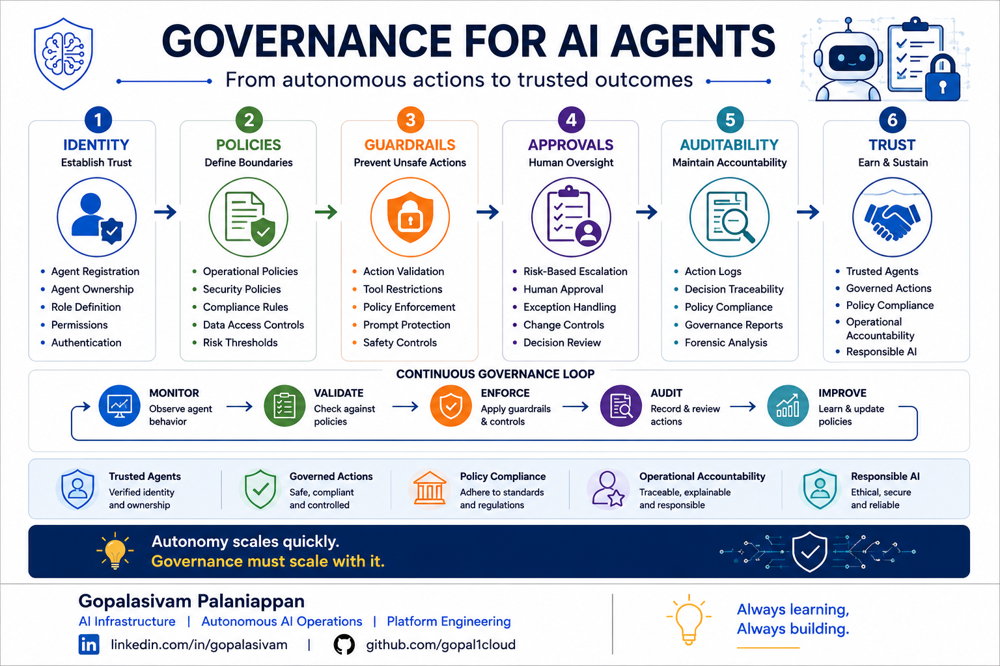

# Governance for AI Agents

**Post Number:** 6  
**Status:** Scheduled  
**Published Platform:** LinkedIn  
**LinkedIn Publish Date:** 2026-06-25  
**LinkedIn URL:** Pending  
**Category:** AI Governance  
**Tags:** AI, AgenticAI, AIOps, AIGovernance, ResponsibleAI, PlatformEngineering, AutonomousOperations, HumanInTheLoop  

## Autonomy scales quickly.

### Governance must scale with it.

As AI agents become more capable, one of the most important questions organizations must answer is:

**How do we govern autonomous decision-making at scale?**

Much of the current conversation focuses on what AI agents can do.

However, in enterprise environments, an equally important discussion is what they should be allowed to do.

As agents gain the ability to interact with infrastructure, APIs, applications, and operational workflows, organizations will need governance models that ensure actions remain secure, compliant, auditable, and accountable.

## Governance Framework for AI Agents

In my view, effective AI agent governance requires a framework built on six foundational layers:

### Identity

Establish trust through:

* Agent Registration
* Agent Ownership
* Role Definition
* Permissions
* Authentication

### Policies

Define operational boundaries through:

* Operational Policies
* Security Policies
* Compliance Rules
* Data Access Controls
* Risk Thresholds

### Guardrails

Prevent unsafe actions through:

* Action Validation
* Tool Restrictions
* Policy Enforcement
* Prompt Protection
* Safety Controls

### Approvals

Introduce appropriate oversight through:

* Risk-Based Escalation
* Human Approval
* Exception Handling
* Change Controls
* Decision Review

### Auditability

Maintain accountability through:

* Action Logs
* Decision Traceability
* Policy Compliance Reporting
* Governance Reporting
* Forensic Analysis

### Trust

The outcome of effective governance:

* Trusted Agents
* Governed Actions
* Policy Compliance
* Operational Accountability
* Responsible AI

## Continuous Governance Loop

Governance should not be treated as a one-time control.

Autonomous systems require continuous validation and improvement.

### Monitor → Validate → Enforce → Audit → Improve

Each governance cycle strengthens operational trust and reduces risk while enabling organizations to scale autonomy responsibly.

## Key Concepts

* AI Agent Governance
* Policy Enforcement
* Operational Guardrails
* Human-in-the-Loop Controls
* Auditability
* Decision Traceability
* Responsible AI
* Trusted Autonomous Systems

## Discussion

As AI agents become operational participants rather than simple assistants, governance may become as important as intelligence itself.

Because ultimately:

> **Autonomy scales quickly. Governance must scale with it.**

What governance controls do you believe should be mandatory for enterprise AI agents?

How are you approaching policy enforcement, accountability, and trust for autonomous systems?

---

**Gopalasivam Palaniappan**

AI Infrastructure | Autonomous AI Operations | Platform Engineering

💡 Always learning, Always building.
