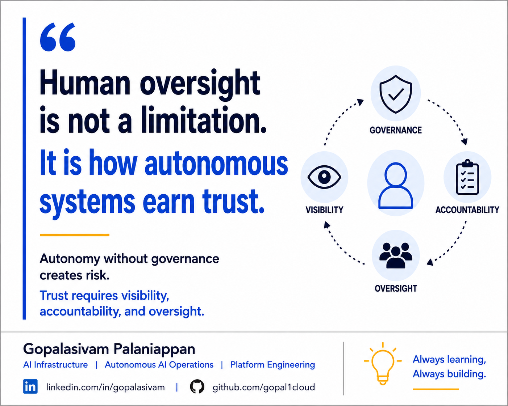

# Human-in-the-Loop Controls Are Not a Weakness

**Post Number:** 4  
**Status:** Scheduled  
**Published Platform:** LinkedIn  
**LinkedIn Publish Date:** 2026-06-18  
**LinkedIn URL:** Pending  
**Category:** AI Governance  
**Tags:** AI, AgenticAI, AIOps, PlatformEngineering, AutonomousAIOperations, AIGovernance, HumanInTheLoop, ResponsibleAI  

## Human oversight is not a limitation.

### It is how autonomous systems earn trust.

One misconception I often hear about autonomous systems is that the ultimate goal is to completely remove humans from operational decision-making.

I'm not convinced that's the right objective.

As AI systems become more autonomous, governance becomes increasingly important.

In many enterprise environments, the challenge isn't simply enabling autonomous actions.

The challenge is determining:

* Which decisions can be automated?
* Which decisions require oversight?
* When should escalation occur?
* How is accountability maintained?
* How is operational trust established?

In my view, human-in-the-loop controls are not a sign of weakness.

They are often a critical design principle.

For low-risk operational actions, autonomy may be entirely appropriate.

Examples may include:

* Routine operational tasks
* Automated health checks
* Capacity recommendations
* Self-healing workflows
* Policy validation checks

However, for high-impact decisions affecting:

* Security
* Compliance
* Infrastructure
* Business operations
* Data governance

human oversight can provide an important layer of governance, accountability, and risk management.

Autonomous systems should help operators make better decisions.

They should not eliminate visibility into how decisions are being made.

As organizations continue adopting AI-driven operations, one of the most important questions becomes:

How do we balance autonomy with governance?

Because ultimately, trust is not built through autonomy alone.

Trust is built through:

* Transparency
* Accountability
* Observability
* Governance
* Responsible operational controls

The future of autonomous operations is not about removing humans from the loop.

It is about ensuring that autonomy and governance work together to create trusted operational systems.

## Discussion

As AI systems become more autonomous, where do you believe human oversight should remain mandatory?

Should there always be a human approval layer for high-impact operational decisions?

---

**Gopalasivam Palaniappan**

AI Infrastructure | Autonomous AI Operations | Platform Engineering

💡 Always learning, Always building.
