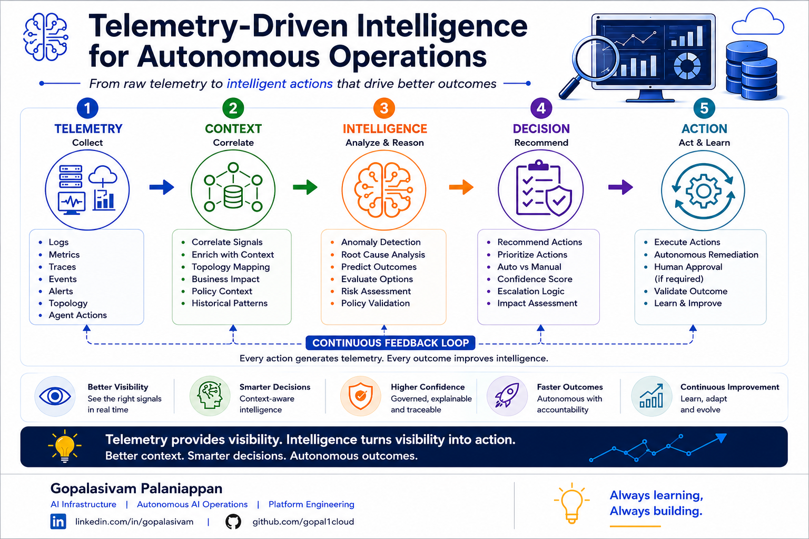

# Telemetry-Driven Intelligence for Autonomous Operations

**Post Number:** 5  
**Status:** Scheduled  
**Published Platform:** LinkedIn  
**LinkedIn Publish Date:** 2026-06-23  
**LinkedIn URL:** Pending  
**Category:** Autonomous AI Operations  
**Tags:** AI, AgenticAI, AIOps, PlatformEngineering, Observability, OperationalIntelligence, AutonomousOperations  

## Telemetry provides visibility.

### Intelligence turns visibility into action.

As AI systems become more autonomous, telemetry is becoming far more than an operational monitoring tool.

Traditionally, telemetry has helped operations teams answer questions such as:

* What happened?
* When did it happen?
* Where did it happen?

But autonomous operations introduce a different challenge.

The question is no longer just about collecting telemetry.

It is about transforming telemetry into operational intelligence.

For example:

* Which signals actually matter?
* What context should be considered?
* What patterns indicate emerging risk?
* What remediation options are available?
* When should human approval be required?

Collecting more logs, metrics, traces, and events does not automatically create better operational outcomes.

In many environments, teams are already overwhelmed with telemetry.

The real opportunity lies in correlating signals, applying context, and transforming data into actionable intelligence.

In my view, autonomous operations depend on a continuous cycle:

### Telemetry → Context → Intelligence → Decision → Action

Each action generates new telemetry.

Each outcome improves future decisions.

This creates a continuous feedback loop that enables systems to become increasingly adaptive, context-aware, and operationally effective.

As AI platforms become more dynamic, organizations will need systems that can move beyond visibility alone and begin delivering context-aware operational intelligence.

Because ultimately:

> **Telemetry provides visibility. Intelligence turns visibility into action.**

## Key Concepts

* Telemetry Collection
* Context Correlation
* Operational Intelligence
* Decision Support
* Autonomous Actions
* Continuous Feedback Loops
* AI-Aware Observability
* Autonomous Operations

## Discussion

As organizations collect increasing volumes of operational telemetry, an important question emerges:

**Are we successfully turning telemetry into intelligence—or are we simply collecting more data?**

How are you approaching telemetry, operational intelligence, and autonomous decision-making in modern AI environments?

---

**Gopalasivam Palaniappan**

AI Infrastructure | Autonomous AI Operations | Platform Engineering

💡 Always learning, Always building.
