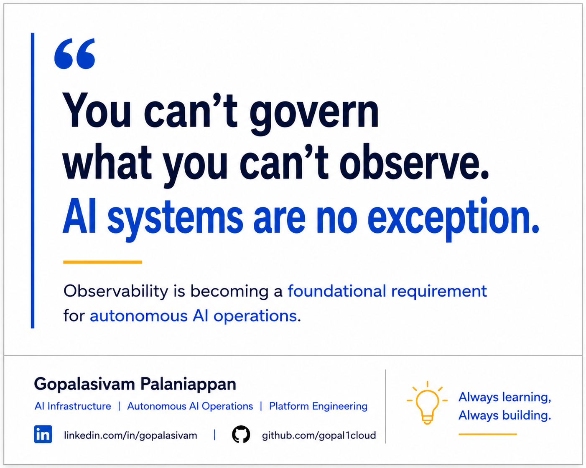

# Why AI-Aware Observability Matters for Autonomous AI Systems

**Post Number:** 3  
**Status:** Scheduled  
**Published Platform:** LinkedIn  
**LinkedIn Publish Date:** 2026-06-16  
**LinkedIn URL:** -  
**Category:** Autonomous AI Operations  
**Tags:** AI, AgenticAI, AIOps, PlatformEngineering, AutonomousAIOperations, Observability, Telemetry, OperationalVisibility

## You can't govern what you can't observe.

### AI systems are no exception.

As AI systems become more autonomous, observability is becoming one of the most important foundations for operational trust.

Traditional observability was primarily designed to help operators understand applications, infrastructure, services, and user interactions.

Modern AI systems introduce an entirely new set of operational questions.

For example:

* Why did an AI agent take a particular action?
* What information influenced its decision?
* What telemetry was available at that moment?
* Was the action aligned with operational policies?
* Could the outcome have been predicted earlier?

In many cases, understanding what happened is no longer enough.

Organizations increasingly need visibility into why something happened.

This is where AI-aware observability becomes critical.

Beyond traditional logs, metrics, and traces, AI environments may require deeper visibility into:

* Agent actions and workflows
* Operational context
* Policy decisions
* Reasoning pathways
* Remediation activities
* Governance events
* Human approval interactions
* Autonomous system outcomes

As autonomous AI systems become more integrated into enterprise operations, observability will play a critical role in building:

* Trust
* Accountability
* Governance
* Operational confidence
* Compliance readiness

The future of observability is not only about monitoring infrastructure.

It is increasingly about understanding autonomous decision-making systems and maintaining visibility into how those systems operate.

## Discussion

Are existing observability platforms ready for autonomous AI workloads?

Or do we need a new generation of AI-aware observability platforms designed specifically for autonomous operations?

---

**Gopalasivam Palaniappan**

AI Infrastructure | Autonomous AI Operations | Platform Engineering

💡 Always learning, Always building.
